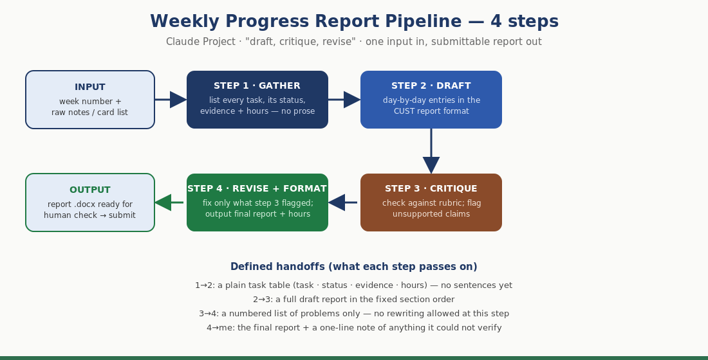

# Ship an Automation Workflow — Weekly Progress Report Pipeline

**FL-04 · General AI Fluency · Week 4 · Muhammad Saad Imran**

## Why this pipeline

From my FL-01 audit, "messages and reports" is the task I actually repeat: every week I write a progress report for my university supervisor, Mr. Temour Abbas, in a fixed CUST format. I had already written four of them, so I have a real manual baseline to compare against — which is why I chose this over a pipeline I had never done by hand.

It is a "draft, critique, revise" pipeline, built as a **Claude Project** (free with my existing account; custom GPTs need a paid plan, so that path was out).

## The flow



**Four distinct steps with defined handoffs:**

| Step | Does | Hands off |
|---|---|---|
| 1 · GATHER | Lists every task that week: name, track, status, evidence, hours. No prose. | A plain task table + a gaps list |
| 2 · DRAFT | Turns the table into day-by-day entries in the CUST section order | A full draft report |
| 3 · CRITIQUE | Checks the draft against the rubric; flags unsupported claims. **Does not rewrite.** | A numbered list of problems only |
| 4 · REVISE + FORMAT | Fixes only what step 3 flagged; outputs the final report + hours table | Final report + a note of anything unverifiable |

Separating critique from drafting is the design decision that matters. A single "write it and make it good" prompt grades its own work and always passes. Splitting them is what makes the pipeline catch things.

## The configuration and prompts

### Project instructions (standing, set once)

```
You help me produce my weekly university internship progress report.

Context: I am Muhammad Saad Imran (BSE233117), a Software Engineering student at
CUST Islamabad, doing a remote Machine Learning internship at FlyRank AI.
Organisation supervisor: Mr. Mirza Ašćerić. University supervisor: Mr. Temour Abbas.
University internship manager: Mr. Taimoor Riaz.

The report format is fixed, in this order:
Title page → Acknowledgement → Contents → Introduction → Daily Assignment Tasks
(Monday to Sunday) → Summary of Deliverables (with a workload table) → Tools &
Technologies → Conclusion → References.

Rules that never change:
- Never state a task is complete unless I have given you evidence for it.
- Never invent hours, dates, names, or results.
- If something is missing, list it as a gap. Do not fill it in.
- Plain professional English. No buzzwords.

I will send you one step at a time, labelled STEP 1 of 4 through STEP 4 of 4.
Do only the step I ask for. Do not jump ahead.
```

### Step 1 — GATHER
```
STEP 1 of 4. Do not write any report prose yet.
Here are my raw notes for week {N}: {paste notes}
Return ONLY a table with these columns:
task | track | status | evidence I gave you | hours
Add a final row listing anything you cannot verify from my notes.
```

### Step 2 — DRAFT
```
STEP 2 of 4. Using ONLY the table from step 1, write the report in the fixed
section order. Daily entries Monday to Sunday; if a day has no task, say so
plainly rather than inventing one. Do not add any fact that is not in the table.
```

### Step 3 — CRITIQUE
```
STEP 3 of 4. Do NOT rewrite the report. Review the draft and return a numbered
list of problems only:
1. Any claim not supported by the step-1 table
2. Any missing required section
3. Any hours that do not add up
4. Any vague sentence that would not survive my supervisor asking "how do you know?"
If a section is fine, do not mention it.
```

### Step 4 — REVISE + FORMAT
```
STEP 4 of 4. Fix ONLY the numbered problems from step 3. Do not restyle anything
that was not flagged. Then output the final report, plus:
- the workload table with a total
- a one-line list of anything you still could not verify
```

## The five runs

| # | Input | Time | What it actually caught |
|---|---|---|---|
| 1 | **Week 1** — 5 assignments, Academy course, three sessions | **20m 29s** | Flagged **10 gaps**. Top ones: *"No hours for any task, and no weekly total"* and *"No day-by-day mapping."* It also declared that the track labels (AI Fluency / Machine Learning) were **its own inference from the FL-/ML- prefixes**, not something I had told it. |
| 2 | **Week 2** — ML-03, Frame It as Cases, Prompt Ladder, FL-02 | *(within the 40m block)* | Noted the 18 h total **covers only the four graded tasks** — the session and Academy hours were missing, so the weekly total was incomplete. Flagged that my ML-03 findings (the 5.6% figure) were quoted from my notes and **unverified by it**. |
| 3 | **Week 3** — ML-04, Identity Kit, Curate Images, Content Map | *(within the 40m block)* | Flagged **"Mr. Haris Fojdic is a new name in these notes — role and relationship to FlyRank not stated."** Also listed every ML-04 number (176,738 pages, 3.61M of 9.84M rows, R² 0.037 → 0.874) as quoted and unverified. |
| 4 | **Week 4** — ML-07, blank page live, stack choice | *(within the 40m block)* | **The best catch of the five.** It noticed that *"today is 6 August, so Thu 6 – Sun 9 August have not happened yet — this week is not finished and cannot be reported as closed."* It also spotted that **ML-05 and ML-06 are missing** from my sequence: weeks 1–3 ran ML-01 to ML-04, then the notes jump to ML-07 with no explanation. |
| 5 | **BRAND NEW INPUT** — deliberately thin: one task in progress, one *not started*, one reading task, no evidence | *(within the 40m block)* | Ran end to end and **refused to claim anything was done.** It correctly recorded "Agent Concepts and MCP Basics" as **not started**. Then it cross-checked against my own earlier record and found that **the 0.185 MAE "frozen Week-4 baseline" does not appear anywhere in my Week 4 notes** — those gave percentages and row counts, not MAE. Its closing line: *"as it stands this week has one item in progress, one not started, one reading task, and zero evidence."* |

**Runs 1 total: 20m 29s. Runs 2–5 together: 40m 10s** (about 10 minutes each once I knew the flow).

Run 5 is the graded "brand new input" test. It passed in the way that matters: it did not produce a flattering report from thin material — it produced an honest refusal with a list of what it needed.

## Time accounting (honest, including setup)

| Item | Time |
|---|---|
| Designing the four-step flow and writing the prompts | ~60 min |
| Creating the Claude Project and writing the standing instructions | ~25 min |
| **Total setup cost** | **~1 h 25 min** |
| **Manual baseline** — one weekly report, typed with unstructured AI help and no pipeline | **90–120 min** |
| Run 1 (first time, learning the flow) | 20 min 29 s |
| Runs 2–5 (average once familiar) | ~10 min each |
| **Saved per run** | **~70–110 min** |

**Has it paid for itself?** Yes, on the first use. Setup was ~85 minutes; the very first run saved roughly 70–100 minutes against my manual baseline. Everything after run 1 is profit, and the runs got faster with familiarity — from 20 minutes down to about 10.

An honest caveat on the baseline: my "manual" reports were typed with AI help, not written from scratch. So this is not "AI versus no AI" — it is **unstructured AI help versus a structured pipeline**. The saving comes from not re-deciding the format, the section order, and the checking discipline every single week.

## Where it breaks (and what a human must still check)

**1. It cannot verify a single number I give it — and it says so every time.** Every run flagged my figures as "quoted from your notes and unverified by me." It has no access to my GitHub, my portal, or my notebooks. If my step-1 notes are wrong, the report is confidently wrong.

**2. It infers things I did not tell it, but flags the inference.** In runs 1 and 2 it assigned track labels from the FL-/ML- prefixes and then declared that this was a guess. Useful behaviour — but it means the report contains inferences, and only the flag stops them passing as fact.

**3. It has no day-by-day information.** Every single run flagged the missing Monday-to-Sunday mapping. My notes are task lists, not diaries, so the daily section is the weakest part of every draft.

**4. It cannot tell "started" from "succeeded."** In run 5 it recorded the modelling work as started, then noted there was no model type, no MAE achieved, and no comparison outcome — *"'trained a first model' is not the same as 'beat the baseline' and I have not recorded it as either."* That distinction is mine to supply.

**Human review is mandatory before submitting:**
- Check every "submitted" against the actual portal and repo
- Supply the day-by-day mapping it always asks for
- Check the hours are ones I would defend out loud
- Read the conclusion for overstatement
- Resolve every line on its "cannot verify" list

## What surprised me

I expected the pipeline to save time. I did not expect it to be a **better auditor of my own record than I am**. Run 4 caught that I was trying to close a week that had not finished yet, and that two assignments (ML-05, ML-06) had silently vanished from my sequence. Run 5 caught that I had quoted a baseline number that does not appear in my own prior week's notes. Neither of those is a formatting benefit — they are accuracy catches I would have missed.

## What I would change next

The core weakness is that step 1 depends on the quality of my notes. The obvious next version reads my GitHub commits and portal submissions directly, so the gather step sees reality instead of my memory of it. That needs tooling beyond a Claude Project — which is exactly what the agent and MCP work covers next.
