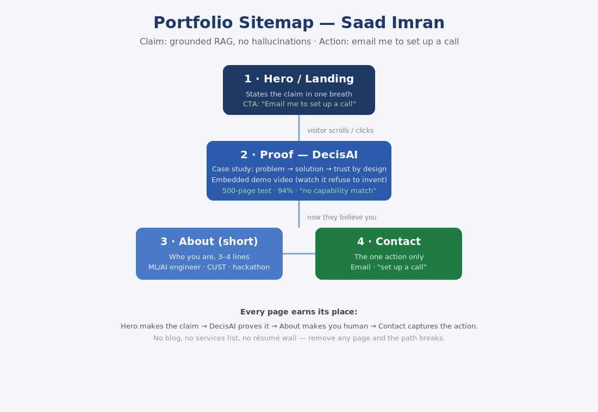
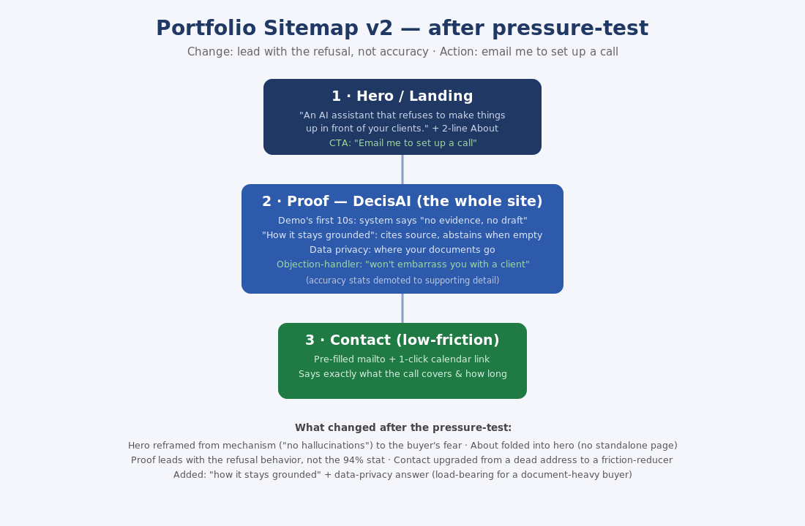

# Draw the Path — Portfolio Sitemap + Toolkit

**Track:** General AI Fluency · **Week 1** · **Phase:** Setup
**Intern:** Saad Imran

---

## Proof statement

> I build RAG systems that answer strictly from your own documents and refuse to invent anything — when the evidence isn't there, they say so instead of hallucinating. I proved it with DecisAI, a bid-response assistant that reads 500-page tenders and drafts a response only when the evidence backs it up. I'm proving this to a founder or operations lead at a document-heavy company, so they'll email me to set up a call.

## Toolkit (all free accounts created)

Claude · ChatGPT · Gemini · Perplexity — main build partner: **Claude**.

## AI workspace

Claude Project **"Portfolio Build — Grounded RAG (DecisAI)"**, with the proof statement pasted into the Instructions field and a request to act as a tutor. Follows the build for all 10 weeks. See `claude-project.png`.

## Sitemap

**v1 (initial):**

**v2 (after pressure-test):**

## Pressure-test

I ran a prompt inside the Project asking it to critique the sitemap against my claim and my one action (see `pressure-test.png`). Key findings: the hero led with the mechanism ("no hallucinations") instead of the buyer's fear; the proof page led with the wrong number (94% accuracy is a commodity) instead of the real differentiator (the refusal — "no evidence, no draft"); About didn't earn a page; Contact was a dead end.

**The one change I'm making:** stop leading with accuracy — lead with the refusal. The hero and the demo's first ten seconds become the moment DecisAI declines to answer ("no evidence, no draft"), because that behavior — not the 94% stat — is the only thing on the site a competitor can't copy, and it's what earns the email. The v2 sitemap applies this.

## Files

- `Draw-the-Path_Deliverable.docx` — full write-up
- `sitemap-v1.png`, `sitemap-v2.png` — sitemaps
- `claude-project.png` — configured Claude Project (Instructions filled)
- `pressure-test.png` — pressure-test prompt + output
